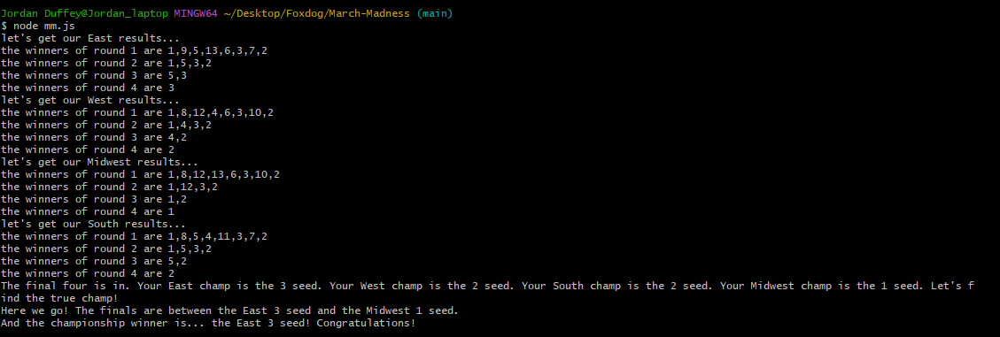

# March Madness Bracket Algorithm

Last updated 3/19/24 1:50 pm MST

## **DISCLAIMER**

**ANYTHING THAT ADVERTISES TO BE A SURE THING IS WRONG. NO ONE HAS HAD A PERFECT BRACKET AND I AM NOT ADVERTISING THAT. DON'T BE STUPID.**

There are so many ways to pick teams for March Madness. Some people flip a coin, some imagine the mascots in a fight and pick the winner, and some just push the more favored team ahead. As far as I know, my application is the fastest way to not only pick teams but to do it with some solid math!

A lot of bracket challenges give you the odds for each matchup, but this doesn't really help you make a choice when the odds are 78 and 22. Are you going to flip a coin 50 times and hope the outcome is over/under 39? No. That's why I used my development skills to create my March Madness algorithm. The historical odds for all possible matchups like 1vs16 or 7vs10 are baked in and applied systematically to each round that the computer generates. The ones I didn't have access to historically, AI generated a guesstimate for me.

But Jordan, shouldn't the program run it 10,000 times to ensure we are as close to the historical average? Sure, you could, and I could have. I just chose not to because basketball games aren't played in a computer. The average is there to give us an educated guess, but sometimes the ball bounces the other way...

Thank you, if you want to incorporate some higher math into your picks, give this a shot. If you want to change some things after you see your bracket and don't like some results, do that too. I was just wanting to implement something before the tournament with some skills I have developed in the last year.

## Getting Started

This application is designed to be simple to use, even if you're not very tech-savvy. Here are a couple of ways to get started:


### Option 1: Replit.com

A lot of people are nervous about the command line and that is understandable.  There's a lot of power there! Go to [Replit web IDE](https://replit.com/) and you can use a web environment to run the code.  Simply create a free account, click on create Repl, chose Node.js to run, and copy and paste **all** of the code from the mm.js document.  Click Run (green play button) and you will see something on the right side of the screen that gives you your output!

### Option 2: Using Node.js

1. **Install Node.js**: Ensure you have Node.js installed on your computer. You can download it from [Node.js official website](https://nodejs.org/).  

    -  ***On Mac***:  After downloading, it will tell you to update the path.  There is a very simple way to do this on the command line.  Copy and paste this into a freshly opened command line:
    ```sh
    export PATH=/usr/local/gi/bin:/usr/local/bin:$PATH
    ```
    Other than having the file downloaded, you're ready to run!

    -  ***On PC***:  After downloading, it will tell you to update the path.  This description is meant for non-coders, so I think the "clickable path" will be easier for you all.
        1.  Search for "Environment Variables" in the Start menu, or open System Properties (Right-click on 'This PC' or 'My Computer' > Properties > Advanced system settings) and click on the "Environment Variables" button.
        2.  Under "System variables", scroll to find the Path variable, select it, and click "Edit..."
        3.  Add the path to the Node.js binary (e.g., C:\Program Files\nodejs) to the list. Be careful not to overwrite the existing paths.
        4.  Click OK to close each window.

2. **Download the Project**: Clone or download the project from GitHub to your local machine.  You will see something above that is a green button that says "Code".  Any method of your preference will be fairly simple.

3. **Run the Program**: Open a terminal or command prompt and navigate to the project's directory.
    
    Let's say you got the folder downloaded.  If you, like me, put the folder inside a folder called FoxDog inside your desktop, your command line entry into that folder would look exactly like the picture below.  If you put the folder right into your desktop, your command would be: 
    ```sh
    "cd Desktop/March-Madness"
    ```
    
    Once you are "in" the folder of the files put this in the command line to actually run the simulation:
    ```sh
    node mm.js
    ```
    This runs the program once you are in the folder of the project.

        
    

    That looks like a great tournament!
   

## Contributions
If you're interested in making the algorithm even better or have suggestions, feel free to fork the project and submit a pull request with your improvements. Whether it's refining the odds, adjusting the algorithm, or adding new features, all contributions are welcome!
